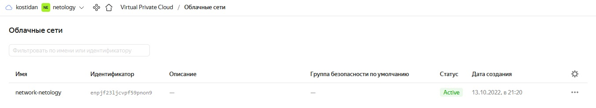
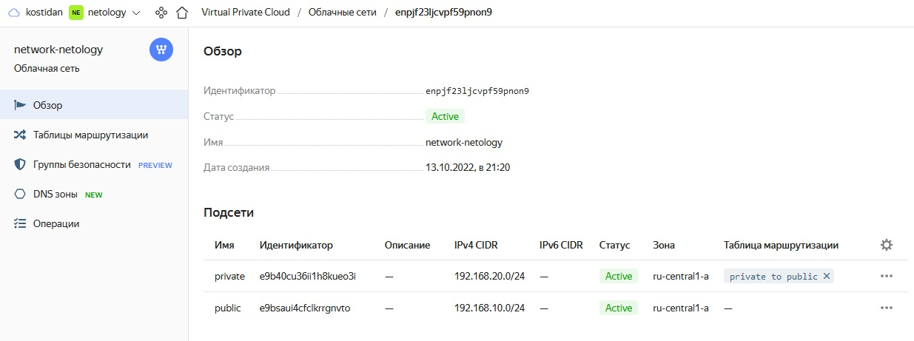
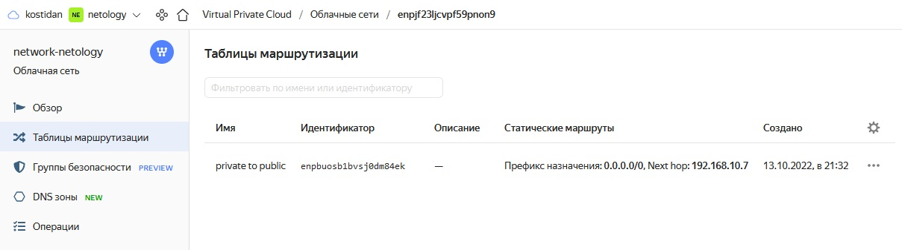
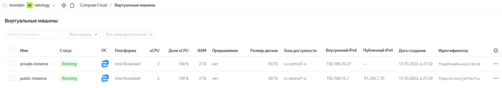
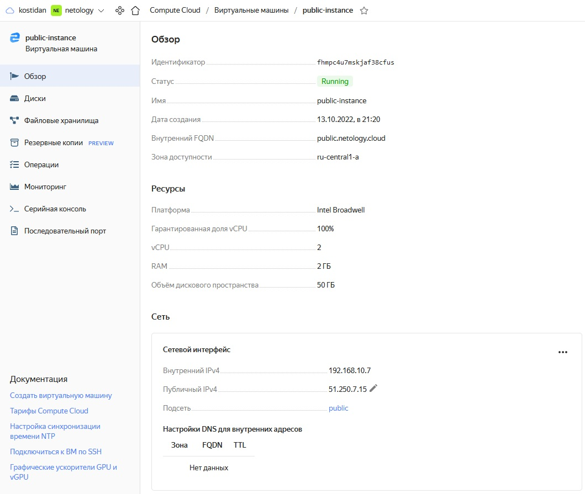
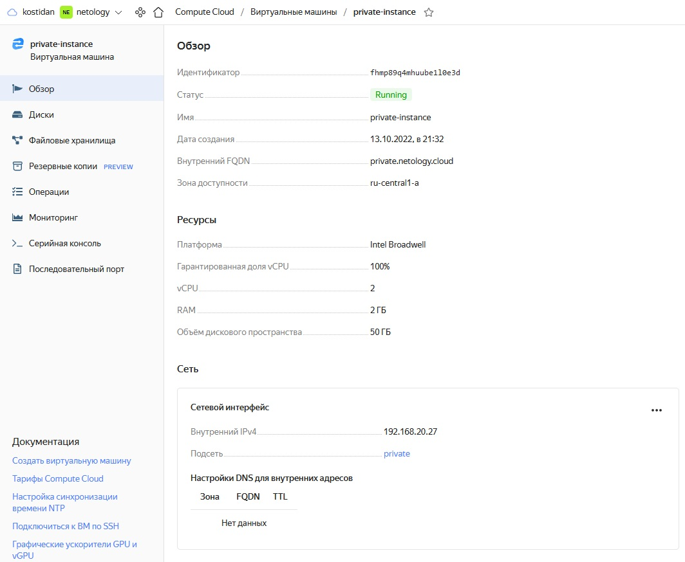

# Домашнее задание к занятию "15.1. Организация сети"

> ## Задание 1. Яндекс.Облако (обязательное к выполнению)
> 
> 1. Создать VPC.
> - Создать пустую VPC. Выбрать зону.
> 2. Публичная подсеть.
> - Создать в vpc subnet с названием public, сетью 192.168.10.0/24.
> - Создать в этой подсети NAT-инстанс, присвоив ему адрес 192.168.10.254. В качестве image_id использовать fd80mrhj8fl2oe87o4e1
> - Создать в этой публичной подсети виртуалку с публичным IP и подключиться к ней, убедиться что есть доступ к интернету.
> 3. Приватная подсеть. 
> - Создать в vpc subnet с названием private, сетью 192.168.20.0/24.
> - Создать route table. Добавить статический маршрут, направляющий весь исходящий трафик private сети в NAT-инстанс
> - Создать в этой приватной подсети виртуалку с внутренним IP, подключиться к ней через виртуалку, созданную ранее и убедиться что есть доступ к интернету

Результат в консоли ЯО:


Виртуальная сеть:


Подсети:


Таблица маршрутизации:


Виртуальные машины:


Public instance:


Private instance:


Подключаемся к public и проверяем интернет:
```
vagrant@vagrant:~/clokub-homeworks/15.1/terraform/yandex$ ssh -i id_rsa_netology ubuntu@51.250.7.15
Welcome to Ubuntu 18.04.1 LTS (GNU/Linux 4.15.0-29-generic x86_64)

 * Documentation:  https://help.ubuntu.com
 * Management:     https://landscape.canonical.com
 * Support:        https://ubuntu.com/advantage


#################################################################
This instance runs Yandex.Cloud Marketplace product
Please wait while we configure your product...

Documentation for Yandex Cloud Marketplace images available at https://cloud.yandex.ru/docs

#################################################################


The programs included with the Ubuntu system are free software;
the exact distribution terms for each program are described in the
individual files in /usr/share/doc/*/copyright.

Ubuntu comes with ABSOLUTELY NO WARRANTY, to the extent permitted by
applicable law.

To run a command as administrator (user "root"), use "sudo <command>".
See "man sudo_root" for details.

ubuntu@public:~$ ping ya.ru
PING ya.ru (87.250.250.242) 56(84) bytes of data.
64 bytes from ya.ru (87.250.250.242): icmp_seq=1 ttl=58 time=0.922 ms
64 bytes from ya.ru (87.250.250.242): icmp_seq=2 ttl=58 time=0.385 ms
64 bytes from ya.ru (87.250.250.242): icmp_seq=3 ttl=58 time=0.400 ms
^C
--- ya.ru ping statistics ---
3 packets transmitted, 3 received, 0% packet loss, time 2012ms
rtt min/avg/max/mdev = 0.385/0.569/0.922/0.249 ms
```
Подключаемся из public в private и проверяем интернет:

```
ubuntu@public:~$ ssh -i .ssh/id_rsa_netology ubuntu@192.168.20.27
The authenticity of host '192.168.20.27 (192.168.20.27)' can't be established.
ECDSA key fingerprint is SHA256:3GTszgayrzlh9Jo93J/5rLZkWrRiSxQq/AGpX0Uj15M.
Are you sure you want to continue connecting (yes/no)? yes
Warning: Permanently added '192.168.20.27' (ECDSA) to the list of known hosts.
Welcome to Ubuntu 18.04.1 LTS (GNU/Linux 4.15.0-29-generic x86_64)

 * Documentation:  https://help.ubuntu.com
 * Management:     https://landscape.canonical.com
 * Support:        https://ubuntu.com/advantage


#################################################################
This instance runs Yandex.Cloud Marketplace product
Please wait while we configure your product...

Documentation for Yandex Cloud Marketplace images available at https://cloud.yandex.ru/docs

#################################################################


The programs included with the Ubuntu system are free software;
the exact distribution terms for each program are described in the
individual files in /usr/share/doc/*/copyright.

Ubuntu comes with ABSOLUTELY NO WARRANTY, to the extent permitted by
applicable law.

To run a command as administrator (user "root"), use "sudo <command>".
See "man sudo_root" for details.

ubuntu@private:~$ ping ya.ru
PING ya.ru (87.250.250.242) 56(84) bytes of data.
64 bytes from ya.ru (87.250.250.242): icmp_seq=1 ttl=56 time=2.04 ms
64 bytes from ya.ru (87.250.250.242): icmp_seq=2 ttl=56 time=0.944 ms
^C
--- ya.ru ping statistics ---
2 packets transmitted, 2 received, 0% packet loss, time 1002ms
rtt min/avg/max/mdev = 0.944/1.494/2.044/0.550 ms
```
Конфигурационные файлы terraform:

- [provider.tf](15.1/provider.tf) - параметры провайдера
- [versions.tf](15.1/versions.tf) - подключение провайдера
- [variables.tf](15.1/variables.tf) - переменные
- [network.tf](15.1/network.tf) - сети, подсети и маршрутизация
- [instances.tf](15.1/instances.tf) - инстансы